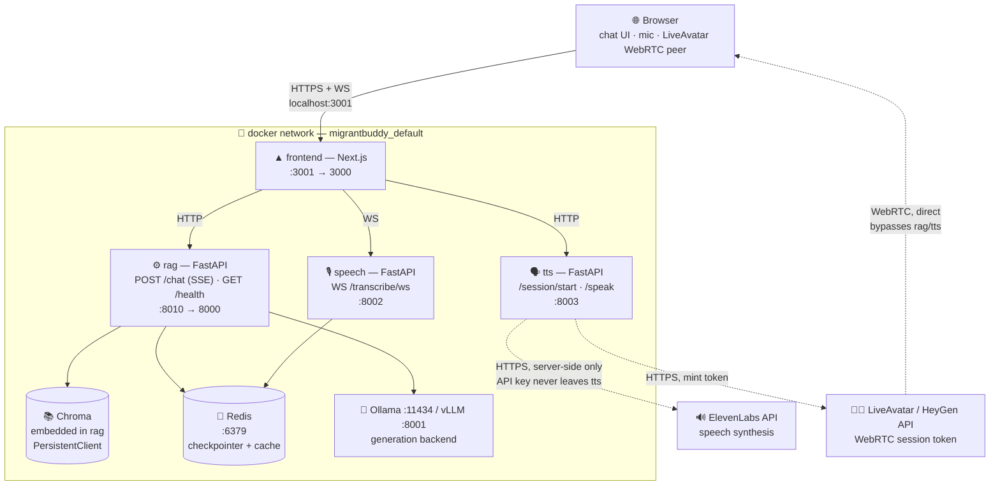

# migrantBuddy

RAG system for Singapore migrant workers — answers employment questions (salary,
working hours, work permits, medical insurance, contact info) grounded in official
MOM documents, in whatever language the question was asked in.

See `CLAUDE.md` for the full architecture and the decisions behind it. This file
covers what the project is, the stack it's built on, how to run it, how the RAG
pipeline actually works, and the eval results behind the model/retrieval choices.

## What it does

A migrant worker asks a question — by typing, or by speaking into the browser — in
English, Tamil, Burmese, Thai, Vietnamese, Malay, Filipino, or Indonesian. The system
retrieves the relevant passage from official MOM (Ministry of Manpower) guidance and
answers **in the language the question was asked in**, with an optional
talking-avatar readback for workers who find spoken answers easier to trust or
follow than text.

The corpus is intentionally narrow and real, not a broad scrape: five MOM source
pages across salary, working hours, work-permit conditions, medical insurance, and
help/contact info. Three other candidate categories (employment rights, work injury/
WICA, housing) were evaluated and dropped — their candidate URLs turned out to be
navigation-only landing pages with no substantive content, confirmed by fetching them
directly rather than assumed.

The core design bet: a multilingual embedding model (BGE-M3) retrieves directly
against non-English queries with no translation step, and a SEA-LION-tuned generation
model answers natively in that language off English-source context — so translation
never becomes a separate pipeline stage on either side of the request. See
[How the RAG pipeline works](#how-the-rag-pipeline-works) below for how that's proven
out, not just asserted.

## Tech stack

| Layer | Technology | Used for |
|---|---|---|
| Frontend | Next.js (TypeScript) | Chat UI, mic capture, streamed-answer rendering, hosts the LiveAvatar WebRTC session |
| API | FastAPI (3 services: `rag`, `speech`, `tts`) | REST + SSE + WebSocket endpoints per service |
| Conversation orchestration | LangGraph | Multi-turn state graph (summarize → rewrite query → retrieve → generate), checkpointed per `thread_id` |
| Embedding | BGE-M3 (`sentence-transformers`) | Multilingual dense embeddings — retrieves non-English queries directly against the English corpus |
| Lexical retrieval | `rank_bm25` | Sparse/lexical half of hybrid retrieval |
| Vector store | Chroma | Persistent index of BGE-M3 embeddings, embedded in-process (no separate service) |
| Reranker | SEA-LION-E5-Embedding-600M | Reorders hybrid retrieval's candidates — settled winner of a 6-way comparison, see [Evaluation results](#evaluation-results) |
| Generation (dev) | Ollama | Local, fast-iteration generation serving |
| Generation (prod) | vLLM | Continuous-batching/PagedAttention generation serving, 4-bit bitsandbytes-quantized for small-VRAM GPUs |
| Generation model | `aisingapore/Llama-SEA-LION-v3-8B-IT` | Answers natively in the query's language — settled winner over `qwen3:8b`, see [Evaluation results](#evaluation-results) |
| Ingestion | `trafilatura` | HTML → markdown extraction (tables kept inline, boilerplate stripped) |
| Speech-to-text | `faster-whisper` | Streaming, multilingual, auto-detects language — no manual language toggle |
| Text-to-speech | ElevenLabs | Synthesizes the spoken answer |
| Avatar | LiveAvatar (HeyGen ecosystem), WebRTC | Lip-synced talking-avatar readback; browser connects to HeyGen directly after a server-minted session token |
| Cache / state | Redis (Memurai on Windows) | LangGraph checkpointer, retrieval cache, rate limiting |
| Evaluation | Ragas | Retrieval metrics (MRR/precision/recall/nDCG) + generation metrics (faithfulness, answer relevancy), judged by `llama3.1:8b` |
| Observability | Langfuse | Per-stage tracing across retrieval and the conversation graph (opt-in) |
| Orchestration | Docker Compose | 8-container local/prod stack — see [Run with Docker](#run-with-docker) |

## Architecture

Four services the team owns, plus backing stores/model runtimes, plus two
third-party APIs — every internal hop is plain HTTP/WS on the Docker network's
service-name DNS; every browser-facing hop goes through a published host port.



**Why four separate services instead of one monolith:**
- `rag` is latency-critical (streams tokens) and CPU/GPU-bound on embedding +
  generation — kept lean, no audio dependencies weighing down its image or
  cold-start.
- `speech` pulls in `faster-whisper` and a large model cache (its own named volume)
  independent of RAG's lifecycle — restarted/scaled without touching chat.
- `tts` is two thin outbound HTTP clients (ElevenLabs, LiveAvatar) with no local
  model — stays a lightweight, fast-building container.
- Each ships as its own Docker build `target` from one shared `Dockerfile`, with its
  own pushable image, for independent deploys.

## Prerequisites

- Python 3.12+
- Node.js 18+ (for the frontend)
- [Ollama](https://ollama.com/), running locally, with the generation model pulled:
  ```
  ollama pull aisingapore/Llama-SEA-LION-v3-8B-IT
  ```
- **ffmpeg**, installed and on your `PATH` — required for speech-to-text
  (`faster-whisper` uses it to decode the audio the browser records). Not a pip
  package; install it separately (e.g. `winget install ffmpeg` on Windows, or grab a
  build from [ffmpeg.org](https://ffmpeg.org/download.html)) and confirm with
  `ffmpeg -version`.

### Configuration

For local secrets (Langfuse keys) and any config overrides, copy `.env.example` to
`.env` and fill it in:

```powershell
copy .env.example .env
```

`.env` is loaded automatically (see `src/migrantbuddy/config.py`) and is gitignored —
never commit real keys. In a deployed environment, set real environment variables
directly instead of using `.env` (env vars always take priority over it anyway).

A few settings are overridable this way (everything else — model names, chunk size,
etc. — is a fixed architecture decision, not meant to vary by environment):

| Env var | Default | Purpose |
|---|---|---|
| `MIGRANTBUDDY_OLLAMA_BASE_URL` | `http://localhost:11434` | Where the backend calls Ollama |
| `MIGRANTBUDDY_OLLAMA_KEEP_ALIVE` | `30m` | How long Ollama keeps the model loaded after a request (avoids a multi-GB reload if the next request comes in after Ollama's 5-min default) |
| `MIGRANTBUDDY_VLLM_BASE_URL` | `http://localhost:8001` | Where the backend calls vLLM (if `GENERATION_BACKEND=vllm`) |
| `MIGRANTBUDDY_GENERATION_BACKEND` | `ollama` | `ollama` or `vllm` — which generation server to call |
| `MIGRANTBUDDY_FRONTEND_ORIGIN` | `http://localhost:3000` | Allowed CORS origin for the API |
| `MIGRANTBUDDY_CHECKPOINTER_BACKEND` | `memory` | `memory` or `redis` — where conversation state (message history, running summary) is persisted — see below |
| `MIGRANTBUDDY_REDIS_URL` | `redis://localhost:6379` | Redis connection string (only used when `CHECKPOINTER_BACKEND=redis`) |
| `MIGRANTBUDDY_CONVERSATION_TTL_SECONDS` | `86400` (24h) | How long an idle conversation survives in Redis before expiring (only used when `CHECKPOINTER_BACKEND=redis`) |
| `MIGRANTBUDDY_RETRIEVAL_CACHE_ENABLED` | `false` | Cache retrieval results in Redis, keyed by (query, top_k) — see below |
| `MIGRANTBUDDY_RETRIEVAL_CACHE_TTL_SECONDS` | `604800` (7 days) | How long a cached retrieval result lives (only used when `RETRIEVAL_CACHE_ENABLED=true`) |
| `MIGRANTBUDDY_RATE_LIMIT_ENABLED` | `false` | Rate-limit `/chat` (Redis) — see below |
| `MIGRANTBUDDY_RATE_LIMIT_MAX_REQUESTS` | `10` | Max requests per client IP per window (only used when `RATE_LIMIT_ENABLED=true`) |
| `MIGRANTBUDDY_RATE_LIMIT_WINDOW_SECONDS` | `60` | Rate limit window, in seconds (only used when `RATE_LIMIT_ENABLED=true`) |
| `MIGRANTBUDDY_WHISPER_MODEL_SIZE` | `small` | Whisper model size for speech-to-text (`tiny`/`base`/`small`/`medium`/`large-v3`, etc.) — see below |
| `MIGRANTBUDDY_WHISPER_DEVICE` | `cpu` | `cpu` or `cuda` — set to `cuda` if you have an NVIDIA GPU |
| `MIGRANTBUDDY_WHISPER_COMPUTE_TYPE` | `int8` | faster-whisper quantization — `int8` is fastest on CPU; use `float16` with `cuda` |
| `MIGRANTBUDDY_WHISPER_RATE_LIMIT_ENABLED` | `false` | Rate-limit the Whisper service's `/transcribe/ws` (Redis) — own toggle/budget, separate from `/chat`'s |
| `MIGRANTBUDDY_WHISPER_RATE_LIMIT_MAX_REQUESTS` | `10` | Max connections per client IP per window (only used when `WHISPER_RATE_LIMIT_ENABLED=true`) |
| `MIGRANTBUDDY_WHISPER_RATE_LIMIT_WINDOW_SECONDS` | `60` | Rate limit window, in seconds (only used when `WHISPER_RATE_LIMIT_ENABLED=true`) |
| `ELEVENLABS_API_KEY` | unset (required) | Your ElevenLabs API key — the TTS service won't work without it |
| `ELEVENLABS_VOICE_ID` | unset (required) | Which ElevenLabs voice to speak with — see below |
| `MIGRANTBUDDY_ELEVENLABS_MODEL_ID` | `eleven_multilingual_v2` | ElevenLabs model — multilingual to match this project's target languages |
| `MIGRANTBUDDY_TTS_RATE_LIMIT_ENABLED` | `false` | Rate-limit the TTS service's `/session/start` and `/speak` (Redis) — own toggle/budget, separate from `/chat`'s and Whisper's (ElevenLabs and LiveAvatar are both metered) |
| `MIGRANTBUDDY_TTS_RATE_LIMIT_MAX_REQUESTS` | `10` | Max requests per client IP per window (only used when `TTS_RATE_LIMIT_ENABLED=true`) |
| `MIGRANTBUDDY_TTS_RATE_LIMIT_WINDOW_SECONDS` | `60` | Rate limit window, in seconds (only used when `TTS_RATE_LIMIT_ENABLED=true`) |
| `LIVEAVATAR_API_KEY` | unset (required) | Your LiveAvatar API key — `/session/start` won't work without it |
| `LIVEAVATAR_AVATAR_ID` | unset (required) | Which LiveAvatar avatar to render — from your LiveAvatar dashboard |
| `MIGRANTBUDDY_LIVEAVATAR_API_URL` | `https://api.liveavatar.com` | LiveAvatar API base URL |
| `MIGRANTBUDDY_LIVEAVATAR_IS_SANDBOX` | `true` | Sandbox mode — test without consuming LiveAvatar credits; turn off for a real end-to-end check |
| `LANGFUSE_PUBLIC_KEY` / `LANGFUSE_SECRET_KEY` / `LANGFUSE_HOST` | unset (tracing off) | Enables Langfuse tracing when **all three** are set — see below |

#### Conversational memory backend

Defaults to `memory` — LangGraph's built-in in-memory checkpointer, no external service,
but conversations are lost on every server restart. Setting `MIGRANTBUDDY_CHECKPOINTER_BACKEND=redis`
persists conversations across restarts, keyed by `thread_id`, with a TTL so idle
conversations expire instead of growing Redis forever.

Redis itself needs to be running somewhere first. Official Redis doesn't support Windows
well; on Windows, [Memurai](https://www.memurai.com/) (free Developer Edition) is a
Redis-API-compatible server that installs as a normal Windows service — no Docker, no
WSL2. It listens on `localhost:6379` by default, matching `MIGRANTBUDDY_REDIS_URL`'s
default.

#### Retrieval caching

Off by default, separate toggle from the checkpointer (you may want one without the
other). Setting `MIGRANTBUDDY_RETRIEVAL_CACHE_ENABLED=true` caches retrieval results in
Redis keyed by (query, top_k) — safe with a long TTL since the corpus only changes on a
deliberate re-ingestion, unlike conversation state. A Redis error or cache miss always
falls back to computing retrieval fresh, and a stale cache entry (e.g. a chunk_id from
before a re-ingestion) is detected and discarded rather than crashing — this cache is
purely a latency optimization, never a correctness requirement.

#### Rate limiting

Off by default. Setting `MIGRANTBUDDY_RATE_LIMIT_ENABLED=true` limits `/chat` (only —
`/health` is never limited) to `RATE_LIMIT_MAX_REQUESTS` requests per client IP per
`RATE_LIMIT_WINDOW_SECONDS` (Redis, fixed-window `INCR`+`EXPIRE`), returning `429` once
exceeded. This exists because Ollama/vLLM can't meaningfully serve concurrent requests
(generation is CPU/GPU-bound) — an unbounded burst would otherwise just queue up and
time out ugly instead of failing cleanly. Like the retrieval cache, this fails open: a
Redis error allows the request through rather than locking everyone out.

#### Speech-to-text

Runs as its own service (`migrantbuddy.speech.main`, port 8002 by default), independent
of the RAG service — see "Run the backend services" below. The 🎤 button next to the
chat input opens a WebSocket directly to it (`/transcribe/ws`) and streams audio live as
you speak (`faster-whisper`, multilingual — no language is pinned, so it auto-detects
Burmese/Tamil/Thai/Vietnamese/etc.); transcribed text appears in the input box
incrementally as each spoken segment is confirmed, for you to review and edit rather
than auto-sent — transcription errors are common, and this app answers
employment/legal-rights questions, where getting the question right matters.
`MIGRANTBUDDY_WHISPER_MODEL_SIZE=small` by default, a balance of multilingual accuracy
against CPU-only inference speed; bump it up if you have a GPU
(`MIGRANTBUDDY_WHISPER_DEVICE=cuda`) or down if `small` is too slow.

#### Text-to-speech + avatar

Runs as its own service (`migrantbuddy.tts.main`, port 8003 by default), independent
of the RAG and Whisper services. The avatar itself is rendered by
[LiveAvatar](https://docs.liveavatar.com) (HeyGen ecosystem), **LITE mode**: LiveAvatar
streams a real, WebRTC-based, lip-synced avatar video straight to the browser, but does
no TTS of its own in this mode — we generate the audio ourselves with ElevenLabs and
feed it in.

Flow: the frontend calls `POST /session/start` once per conversation (lazily, on the
first message sent — not on page load, since minting a session consumes LiveAvatar
credits) to get a short-lived session token, then uses
[`@heygen/liveavatar-web-sdk`](https://github.com/heygen-com/liveavatar-web-sdk)
client-side to connect and attach the video stream. As the chat answer streams in (see
below), the frontend buffers tokens into complete sentences and, for each one, calls
`POST /speak` (ElevenLabs, non-streaming, 24kHz PCM — the rate LiveAvatar's audio
ingest requires) and passes the resulting audio straight into the session's
`repeatAudio()`, which LiveAvatar lip-syncs and renders server-side — no local viseme
analysis on our end. A mute toggle next to the mic button skips voice output entirely,
since both ElevenLabs and LiveAvatar are metered.

**Requires two separate accounts**: `ELEVENLABS_API_KEY`/`ELEVENLABS_VOICE_ID` (audio
generation) and `LIVEAVATAR_API_KEY`/`LIVEAVATAR_AVATAR_ID` (avatar rendering) — the
service will fail on first use without all four.
`MIGRANTBUDDY_LIVEAVATAR_IS_SANDBOX` defaults to `true` so local dev/testing doesn't
burn LiveAvatar credits; turn it off for a real end-to-end check.

#### Streaming answers

`/chat` streams the answer back token-by-token (Server-Sent Events: `sources` once
retrieval completes, then repeated `token` events, then `done`) rather than waiting
for the full answer — reduces perceived latency since text (and, per above, audio)
starts appearing well before generation finishes. This is the same event stream the
TTS sentence-buffering logic in "Text-to-speech + avatar" reads from.

#### Observability (Langfuse)

Tracing is opt-in and off by default. Setting `LANGFUSE_PUBLIC_KEY`, `LANGFUSE_SECRET_KEY`,
and `LANGFUSE_HOST` (self-hosted or [Langfuse Cloud](https://cloud.langfuse.com)) turns on
per-stage tracing — each retrieval stage (`dense`, `bm25_search`, `hybrid`, `rerank`) and
each conversation node (`summarize`, `rewrite_query`, `retrieve`, `generate`) show up as
timed, nested spans under a top-level trace for `ConversationService.answer()`, viewable
in the Langfuse UI. Because this app can handle sensitive queries (e.g. workplace
complaints), think about whether self-hosting Langfuse makes more sense than sending
query text to a third-party cloud instance.

## 1. Backend setup

From the project root:

```powershell
python -m venv .venv
.venv\Scripts\activate
pip install -e ".[dev]"
```

Run the test suite (all mocked — no Ollama/Chroma/network needed):

```powershell
pytest -v
```

## 2. Build the data (ingestion → chunking → embedding → indexing)

The FastAPI backend reads `data/processed/chunks.json` and a Chroma collection at
`data/processed/chroma/` — these don't exist until the pipeline has been run once.
That pipeline currently lives in the notebooks (not yet wired into a single `src/`
script), so run these in order and let each one finish:

1. `notebooks/01_ingestion.ipynb` — fetches the MOM pages, writes `data/processed/ingested.json`
2. `notebooks/02_chunking.ipynb` — writes `data/processed/chunks.json`
3. `notebooks/03_embedding.ipynb` — writes `data/processed/embeddings_bge_m3.npy` + `chunk_ids_bge_m3.json`
4. `notebooks/04_retrieval.ipynb` — Step 2 builds the Chroma collection at `data/processed/chroma/`

Once these have run, `data/processed/` has everything the backend needs.

## 3. Run the backend services

Three independent services, run as three separate processes -- the RAG service
(chat), the Whisper service (speech-to-text), and the TTS service (voice output)
don't depend on each other at runtime, so any of them can be started, stopped, or
restarted alone:

```powershell
uvicorn migrantbuddy.api.main:app --reload --port 8000       # RAG (chat)
uvicorn migrantbuddy.speech.main:app --reload --port 8002    # Whisper (speech-to-text)
uvicorn migrantbuddy.tts.main:app --reload --port 8003       # TTS (voice output)
```

(Port 8001 is reserved for vLLM, hence 8002/8003 here.)

Check they're up:

```powershell
curl http://localhost:8000/health
curl http://localhost:8002/health
curl http://localhost:8003/health
```

Only need some of these? The chat UI works fine without the Whisper/TTS services
running -- it just means the 🎤 button won't connect and answers won't be spoken.

## 4. Run the frontend

```powershell
cd frontend
npm install
copy .env.local.example .env.local
npm run dev
```

Open `http://localhost:3000`. The chat UI calls the RAG service at
`NEXT_PUBLIC_API_BASE_URL` (set in `.env.local`, defaults to `http://localhost:8000`),
the Whisper service directly at `NEXT_PUBLIC_WHISPER_WS_URL` (defaults to
`ws://localhost:8002/transcribe/ws`), and the TTS service directly at
`NEXT_PUBLIC_TTS_API_BASE_URL` (defaults to `http://localhost:8003`) -- there's no
proxying between any of them.

## Run with Docker

An alternative to steps 1, 3, and 4 above — runs the RAG service, Whisper service,
TTS service, frontend, Redis, Ollama, and vLLM as seven containers via one
`docker-compose.yml`.
**Step 2 ("Build the data") is still a local prerequisite either way** — Docker doesn't
run the ingestion/chunking/embedding notebook pipeline, it just bind-mounts whatever
`data/processed/` those notebooks already produced on your machine (read-write, not
read-only -- Chroma writes its own SQLite WAL/lock files even when only querying).

Prerequisites:
- Docker Desktop
- For vLLM specifically: an NVIDIA GPU with Docker Desktop's WSL2 GPU passthrough
  configured (NVIDIA Container Toolkit). Without it, the `vllm` service will fail to
  start — either set that up first, or remove the `deploy:` block from `vllm` in
  `docker-compose.yml` and set `MIGRANTBUDDY_GENERATION_BACKEND=ollama` under `rag`'s
  `environment:` to fall back to Ollama (CPU-friendly, no GPU needed).
- `.env` at the project root (`copy .env.example .env`) — same file the local setup
  uses, for Langfuse keys etc.

```powershell
docker compose build
docker compose up
```

One-time step, once `ollama` is up (pulls the model into the `ollama-data` volume,
persisted across restarts):

```powershell
docker compose exec ollama ollama pull aisingapore/Llama-SEA-LION-v3-8B-IT
```

Check everything's up:

```powershell
curl http://localhost:8010/health   # RAG (8000 is remapped to 8010 -- see note below)
curl http://localhost:8002/health   # Whisper
curl http://localhost:8003/health   # TTS
curl http://localhost:8001/v1/models  # vLLM (once the model's finished loading)
```

Open `http://localhost:3001` (also remapped, see below). The `NEXT_PUBLIC_*` URLs are
baked in as Docker build args instead of read from `.env.local` (see
`frontend/Dockerfile`), so they don't need to match your local dev setup.

> **Port note**: `rag` and `frontend` publish on `8010`/`3001` instead of the `8000`/
> `3000` used by local (non-Docker) dev — those two collided with unrelated containers
> already running on this machine (an `iot-modified` project's Prometheus exporter on
> 8000, Grafana on 3000). If you don't have that conflict, feel free to remap both back
> to `8000`/`3000` in `docker-compose.yml` (update the `rag`/`frontend` `ports:` entries
> and the `frontend` build `args:`/`rag`'s `MIGRANTBUDDY_FRONTEND_ORIGIN` together).

`rag` defaults to `MIGRANTBUDDY_GENERATION_BACKEND=vllm` in `docker-compose.yml` (the
whole reason vLLM's here — it was previously blocked by a Windows-only Long Path error
installing natively) — switch back to `ollama` any time by editing that one env var in
`docker-compose.yml`, no rebuild needed, just `docker compose up -d rag`.

### Pulling prebuilt images from Docker Hub instead of building locally

`rag`, `speech`, `tts`, and `frontend` each have an `image:` tag
(`monikaramesh/migrantbuddy-*`) alongside their `build:` block in
`docker-compose.yml`. `docker compose build`/`up` still build locally by default —
this doesn't change your day-to-day workflow. It just means:

- **Publishing a new version** (after you've built locally and want to share it):
  ```powershell
  docker compose push rag speech tts frontend
  ```
- **Running elsewhere without building** (e.g. a machine without this repo's full
  source, or without the ML dependencies' build requirements):
  ```powershell
  docker compose pull rag speech tts frontend
  docker compose up
  ```
  `up` won't rebuild if a matching image already exists locally (from the pull), so
  this skips the build step entirely.

Note the `frontend` image has `NEXT_PUBLIC_API_BASE_URL`/`NEXT_PUBLIC_WHISPER_WS_URL`
baked in from *this machine's* build (`localhost:8010`/`localhost:8002`) — pulling that
image onto a different machine only makes sense if it'll also reach the backend at
those same addresses (e.g. via the same Docker network or port-forwarding setup);
otherwise it needs rebuilding with different build `args:` for that environment.

### Debugging vLLM in isolation

`vllm`'s config lives in its own `docker-compose.vllm.yml`, included by the main
`docker-compose.yml` (top-level `include:`) rather than defined inline — it's the one
service needing repeated iteration (CUDA version pin, `--max-model-len`, GPU memory
budget), and it doesn't depend on redis/ollama/rag/speech/frontend (only `rag` depends
on it, not the other way around). This means it can be brought up completely on its
own, without the rest of the stack:

```powershell
docker compose -f docker-compose.vllm.yml up
```

`docker compose up` (no `-f`) still brings up the full stack including `vllm`,
unchanged — the split is purely for isolating debugging, not a behavior change.

**Small-VRAM GPUs (e.g. 8GB laptop GPUs)**: SEA-LION-8B's ~15GB (bf16) weights don't
fit on their own, regardless of `--max-model-len`/`gpu_memory_utilization` tuning --
vLLM's rigid upfront memory reservation is built for datacenter-class GPUs (16GB+). If
you hit `ValueError: No available memory for the cache blocks`, check
`nvidia-smi --query-gpu=memory.total --format=csv`; if it's well under ~16GB, the
full-precision model won't fit. `docker-compose.vllm.yml`'s `command` already works
around this with on-the-fly 4-bit quantization (`--quantization bitsandbytes
--load-format bitsandbytes`), which shrinks weights to ~5GB -- confirmed working on an
8GB card (`Model loading took 5.34GB`, full startup, `# cuda blocks: 319`). Tradeoffs:
bitsandbytes quantization is noted by vLLM itself as "not fully optimized" (slower than
non-quantized), and it forces the older V0 engine (`--quantization bitsandbytes is not
supported by the V1 Engine`). If quantized quality/speed isn't good enough,
`ollama` (already in the stack, serving a quantized GGUF build of the same model) is
the other fallback path -- switch `rag`'s `MIGRANTBUDDY_GENERATION_BACKEND` to
`ollama`.

## How the RAG pipeline works

One request flows through offline ingestion (notebook-driven, run once per corpus
change) and five online stages per turn: summarize → rewrite query → retrieve →
rerank → generate.

### Ingestion — fetch, extract, validate

Five MOM source URLs, each hand-tagged with a `category` (salary, working-hours,
work-permit, medical, help) — deliberately not a corpus-wide crawl:

1. **Fetch & cache raw HTML** — plain `requests.get`, then the untouched HTML is
   written to disk *before* any parsing, so extraction can be re-run and debugged
   offline without re-hitting mom.gov.sg.
2. **Extract to markdown** — `trafilatura.extract(..., include_tables=True,
   favor_precision=False)`. `favor_precision=False` is deliberate: trafilatura's
   precision mode trims aggressively and risks cutting real guidance text along with
   boilerplate; recall matters more here.
3. **Assemble the record** — stamps a stable `document_id` (slugified URL),
   `authority="MOM"`, the per-source `category`, and `content_type=
   "official_guidance"`. The corpus itself is monolingual English; multilinguality
   lives entirely on the query side, not in the source documents.
4. **Validate before trusting it** — hard-fails on a missing title, empty text, or
   text under 500 characters (catches a page reduced to near-nothing after
   boilerplate stripping). This is exactly how the WICA and housing pages got caught
   and dropped.

### Chunking — structure-aware, five deterministic passes

Pure text transformation, no I/O or model loading. Token counting is a heuristic
(`len(text) // 4`), not a real tokenizer — accurate enough to budget chunk sizes
without a tokenizer dependency. Target: 300–500 tokens, 15–20% overlap, tuned
against a naive fixed-window baseline across 300/500/800-token and 10%/20%-overlap
variants.

1. **Split on headings** — regex-matches `##`/`###` lines and walks them with a
   level-aware stack, so each section keeps a full breadcrumb (e.g. *"Overtime pay >
   How overtime pay is calculated"*).
2. **Merge undersized sections** — heading-splitting alone leaves plenty of sections
   smaller than the 300-token floor; adjacent sections are merged forward greedily
   until the next one would exceed `chunk_size`.
3. **Protect tables, then split oversized sections** — any section still over budget
   is recursively split at paragraph boundaries with overlap. Every markdown table
   is swapped for a placeholder before splitting, so the splitter can never land
   inside one — tables stay whole even if that pushes a chunk over the nominal size.
4. **Prefix a breadcrumb** — every chunk is prefixed with `"{document title} >
   {heading path}"` before embedding, so a chunk retrieved on its own still carries
   enough context to be understood.
5. **Validate the invariant** — counts table blocks in the source vs. summed across
   that document's chunks; raises if they don't match, catching a split table rather
   than silently shipping a broken chunk.

### Embedding — BGE-M3 (settled)

`BAAI/bge-m3`, 1024-dim, multilingual — chosen specifically so queries in Tamil,
Burmese, Thai, etc. retrieve directly against the English-source corpus with no
pre-retrieval translation step.

### Retrieval — hybrid BM25 + dense, then rerank (settled)

Chroma indexes BGE-M3 dense vectors; `rank_bm25` runs lexical scoring in parallel;
results are combined via Reciprocal Rank Fusion (constant 60) over the top-10
candidates from each, then passed through a reranker. Six strategies were run
head-to-head — see [Evaluation results](#evaluation-results) for why SEA-LION-E5
reranking on top of hybrid retrieval won.

**Open question, not yet resolved:** BM25's lexical overlap mostly disappears for
non-English queries against an English corpus — worth splitting hybrid-vs-dense-only
by query language rather than assuming BM25 helps uniformly.

**Deferred, not built:** query rewriting + dual retrieval (retrieve on both the
original and an English-translated query, then merge) as a targeted fix for that
BM25 weakness — parked until real user query examples exist to confirm it's an
actual problem.

### Generation — SEA-LION 8B (settled)

`aisingapore/Llama-SEA-LION-v3-8B-IT`, chosen over `qwen3:8b` at the same parameter
class specifically to isolate language specialization from model size. Generates
directly in the query's language — confirmed by a 10-query smoke test (7
non-English) with no "answer in the query's language" instruction in the system
prompt; it answered natively every time anyway.

### Conversation memory — LangGraph

Multi-turn state lives server-side, keyed by `thread_id` — the frontend only ever
sends `{message, thread_id}`, never full history. A compiled `StateGraph` runs four
nodes per turn:

- **summarize** — no-op until conversation length crosses a threshold, then
  condenses older turns instead of growing the prompt unboundedly.
- **rewrite_query** — folds history + the latest message into a standalone
  retrieval query. A bare follow-up like "what about for daily-rated workers?" has
  almost no signal for the retriever on its own.
- **retrieve** — the hybrid + SEA-LION-E5 rerank path above, optionally hitting the
  Redis retrieval cache first.
- **generate** — the graph is compiled with `interrupt_before=["generate"]`: it
  pauses right before this node so `/chat` can stream the answer token-by-token from
  outside the graph, then write the finished text back in and resume to `END`. A
  deliberate two-phase invoke, not a single blocking call, purely to make streaming
  and checkpointing compatible.

## Evaluation results

Every retrieval or prompt change that graduates out of a notebook carries a
[Ragas](https://github.com/explodinggradients/ragas) run showing it didn't regress.
Retrieval is scored on MRR/precision/recall/nDCG against a labeled (query,
relevant-chunk) set; generation on faithfulness (groundedness to retrieved context)
and answer relevancy, both judged by `llama3.1:8b`.

### Reranker comparison

10 labeled queries (7 non-English), 16-chunk corpus, k=3. Each query has exactly one
labeled-relevant chunk, so `recall@3` is always identical to `hit@3`, and
`precision@3` is always `hit@3 / 3` (capped at 0.333 even under perfect retrieval) —
the real signal is MRR and nDCG@3, which are rank-position-sensitive:

| Strategy | MRR | Hit@3 | P@3 | Recall@3 | nDCG@3 | Latency |
|---|---|---|---|---|---|---|
| BM25 only | 0.403 | 0.600 | 0.200 | 0.600 | 0.439 | 0.1ms |
| hybrid_rerank + ms-marco-MiniLM | 0.425 | 0.500 | 0.167 | 0.500 | 0.426 | 267ms |
| hybrid (BM25+dense, no rerank) | 0.783 | 0.900 | 0.300 | 0.900 | 0.813 | 55ms |
| dense only (BGE-M3) | 0.875 | 0.900 | 0.300 | 0.900 | 0.863 | 137ms |
| hybrid_rerank + bge-reranker-v2-m3 | 0.817 | 1.000 | 0.333 | 1.000 | 0.863 | 4772ms |
| **hybrid_rerank + SEA-LION-E5** | **0.950** | 1.000 | 0.333 | 1.000 | **0.963** | 4872ms |

Why each strategy lands where it does:
- **BM25 only** misses the correct chunk in top-3 on 4 of 10 queries outright —
  almost all non-English, where lexical term overlap against the English corpus
  barely exists.
- **hybrid_rerank + ms-marco-MiniLM** is *worse than no rerank at all* (0.425 vs
  0.783 MRR): an English-only cross-encoder rescoring a 70%-non-English candidate
  pool actively demotes correct chunks that RRF had already surfaced.
- **hybrid (no rerank) scores below dense-only** despite identical hit@3 (0.900):
  fusing in a noisy BM25 signal doesn't push the correct chunk out of the top 3, but
  dilutes dense's already-strong ordering within it, bumping the right chunk from
  1st to 2nd/3rd often enough to cost 0.09 MRR.
- **bge-reranker-v2-m3 and SEA-LION-E5 tie on hit@3/recall@3** (both perfect 1.000)
  but SEA-LION-E5 wins on MRR (0.950 vs 0.817) and nDCG@3 (0.963 vs 0.863) — it lands
  the correct chunk at rank 1 more consistently, which is the whole point of a
  SEA-LION-tuned reranker on an SEA-language-heavy query set. Latency between the two
  is a wash (4772ms vs 4872ms) — the win is rank quality, not speed.

Two numbers here are honestly unexplained rather than papered over: hybrid
(no-rerank) clocking faster (55ms) than dense-only (137ms) despite doing strictly
more work (dense + BM25 + fusion) — likely a benchmark-ordering/warm-up artifact,
not confirmed; and SEA-LION-E5 (noted as a bi-encoder) costing the same latency as
bge-reranker-v2-m3 (a true cross-encoder) despite the architecture difference.

### Generation model comparison

Ragas, judge `llama3.1:8b`, embeddings BGE-M3, retrieval held constant (hybrid +
SEA-LION-E5 rerank) except where noted:

| Run | Retrieval | Generation | n | Faithfulness | Answer Relevancy |
|---|---|---|---|---|---|
| A | dense only | qwen3:8b | 10 | 0.846 | 0.792 |
| B | hybrid + SEA-LION-E5 | qwen3:8b | 10 | 0.771 | 0.774 |
| C | hybrid + SEA-LION-E5 | qwen3:8b | 8* | 0.794 | 0.828 |
| **06b** | hybrid + SEA-LION-E5 | **SEA-LION-v3-8B-IT** | 8* | **0.900** | 0.813 |

\* Burmese and Thai queries dropped from the 10-query set — Burmese scored 1.0 in
Run A vs 0.25 in Run B on the *identical* query (traced to qwen3 generation
randomness, not a retrieval regression), and Thai scored 0.0 in every run regardless
of model or retrieval (a judge limitation — `llama3.1:8b` struggles to verify
Thai-language answers against English-source context). Both excluded so the
generation-model comparison wasn't swamped by judge noise unrelated to what was
being tested.

Net: SEA-LION generation gives a real faithfulness edge (+0.106 over qwen3:8b on the
same 8 queries, every SEA-LION answer scoring ≥0.7 vs two flagged qwen3:8b answers)
at a small enough answer-relevancy cost (−0.015) to read as noise on 8 queries — a
directional result, not a statistically robust one, but a real edge on the metric
that matters most for a compliance-adjacent domain: don't say things that aren't in
the source.

## Project status

Core pipeline choices (BGE-M3 embedding, hybrid BM25+dense retrieval, SEA-LION-E5
reranker, SEA-LION 8B generation) are settled and extracted into
`src/migrantbuddy/`. The full stack — RAG, speech-to-text, TTS/avatar, frontend,
LangGraph conversation memory, and Docker Compose orchestration — is built and
running; the Redis-backed checkpointer is written but not yet verified against a
live instance, and CI/CD/production deploy haven't been set up yet.
